# Virtus Group Website

Welcome to the Virtus Group website — a futuristic, high-concept web platform built for a next-generation fitness facility. This project showcases an immersive digital presence reflecting Virtus Group’s innovative approach to fitness, wellness, and virtual integration.

---

## Project Overview

Virtus Group is a concept gym brand offering AI-powered fitness pods, smart wearables, virtual coaching, and community events. This website serves as both a showcase and interactive portal with various protected member-only sections, a dynamic blog, event widgets, and a Typeform consultation trigger. We also have some great location across the UK, were aiming to integrate online coaching, AI and in perosn gym classes to great the best fitness community in england.

---

## Technologies Used


### Front-End
- **HTML5**: Semantic markup with consistent structure
- **CSS3**: Flexbox layout, responsive design, custom styling
- **JavaScript**: DOM manipulation, modal control, smooth scrolling

### Interactive Features
- Modal pop-ups for consultations and support
- Login-protected widget revealing member resources
- Section-based navigation with smooth scroll and offset adjustment
- Auto-triggered promotional Typeform modal after 10 seconds

### External Integrations
- Typeform (consultation survey)
- Google Maps (location embed)
- Spotify (mental wellbeing podcast)
- BBC Good Food, Muscle & Fitness, Darebee (resources and challenges)


---

## File Structure

project-root/
├── index.html                         
├── styles.css                         
│
├── /header-content/                  
│   └── Logo.png                       
│
├── /home-widget-1/
│   └── widget-video.mp4            
├── /home-widget-2/
│   └── widget-video.mp4               
├── /home-widget-3/
│   └── widget-video.mp4               
│
├── /home-icon-content/                
│   ├── dumbbell.gif
│   ├── stopwatch.gif
│   ├── bicep.gif
│   ├── heart-rate.gif
│   └── brain-focus.gif
│
├── /resources-front-video/          
│   ├── resources-background.mov      
│   └── resources-background-landscape.mov  
│
├── /resources-content/               
│   ├── image1.png                    
│   ├── image2.png                     
│   ├── image3.png                     
│   ├── image4.png                    
│   ├── image5.png                    
│   ├── image6.png                     
│   ├── image7.png                   
│   ├── image8.png                     
│   └── image9.png                    
│
├── /blog-content/                    
│   ├── blog-1.jpeg                   
│   ├── blog-2.jpeg                  
│   └── blog-3.jpeg                   
│
├── /Events-front-content/          
│   ├── hyrox.mov
│   ├── ultrax.mov
│   └── 220-Tri.mov
│
├── /hyrox-widget-events/            
│   ├── image-1.png                   
│   ├── image-2.png                   
│   ├── image-3.png                   
│   └── image-4.png                   
│
├── /ultra-x-widget-events/          
│   ├── image-1.png                   
│   ├── image-2.png                   
│   ├── image-3.png                   
│   └── image-4.png                   
│
├── /220-widget-events/              
│   ├── image-1.png                   
│   ├── image-2.png                   
│   ├── image-3.png                   
│   └── image-4.png                  
│
├── /Footer-content/                 
│   ├── instagram.png
│   ├── facebook.png
│   └── twitter.png
│
├── /Documents/                      
│   ├── Virtus-group-Operations-overview.docx    
│   ├── Virtus_Group_Privacy_Policy.pptx          
│   └── Virtus_Group_Cookies_Policy.pptx          


---

## Demo Login for Protected Widget

To preview protected resources, use:

```
Username: 1
Password: 2
```

---

## UX & Design Rationale

The design follows current UX standards:

- **Information hierarchy**: Clear section headers, content groupings, and navigation structure
- **User control**: No audio autoplay, modals can be exited easily, login validation
- **Consistency**: Repeated structure in widgets, color use, button feedback
- **Accessibility**: Semantic HTML, alt text on images, responsive design, muted media
- **Confirmation**: Modals, protected login feedback, interaction highlights

Design decisions were made with real gym users in mind—supporting clarity, engagement, and trust.

---


## Attributions & References

### HTML/CSS Design Assistance
- **CSSDeck**: Conceptual inspiration for flex-based layouts and card styles  
- **ChatGPT**: Provided real-time suggestions and code snippets for layout enhancements, animations, and responsive grid design  

### JavaScript & Interactivity
- **ChatGPT DevCommunity**: Guidance on structuring interactive behavior such as modal display, protected content toggles, and widget closure  
- **Stack Overflow**: Code validation, event listener best practices, browser compatibility tweaks  
- **Jon Duckett — JavaScript & jQuery**: Referenced for foundational JS knowledge, form validation, and DOM scripting patterns  
- **Personal Research**: Self-taught JavaScript patterns and enhancements through experimentation and community tutorials  

### AI & Documentation
- All JavaScript, layout structuring, and responsive behavior were partly shaped by **ChatGPT (OpenAI)**, used to accelerate learning and iterate solutions with accuracy  


---

## Features

- Dynamic modal popups for booking & contact
- Protected resource portal with basic login gate
- Responsive video banners and widget integration
- Timeline visual of company history
- Interactive event widgets using `<details>` + `<summary>`
- Embedded Google Maps for physical location reference

---

## Testing Evidence

Below is visual proof of the key testing stages.

### HTML Validation Pass
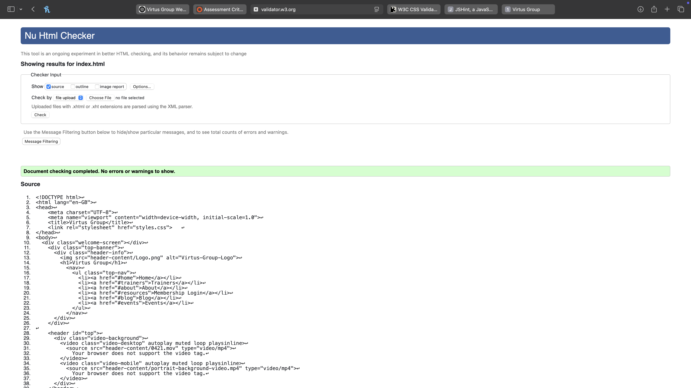

### CSS Validation Pass
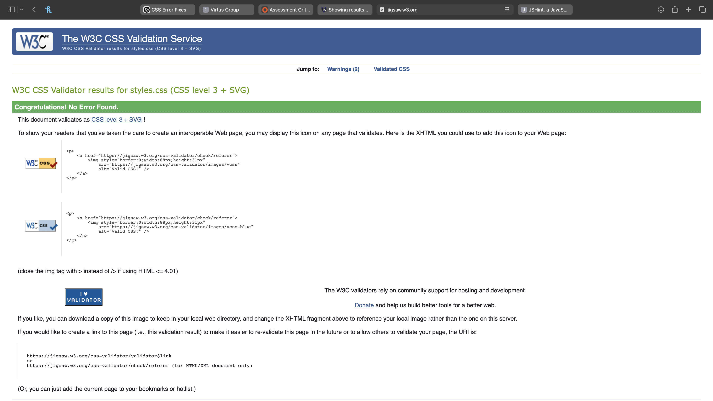

### Protected Widget Login Success


### Modal Interaction Test
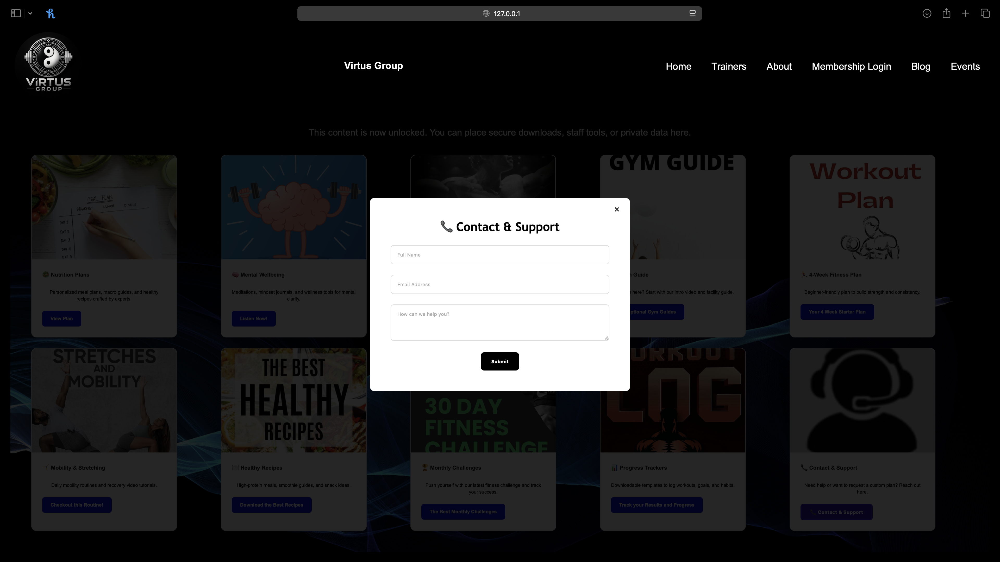  
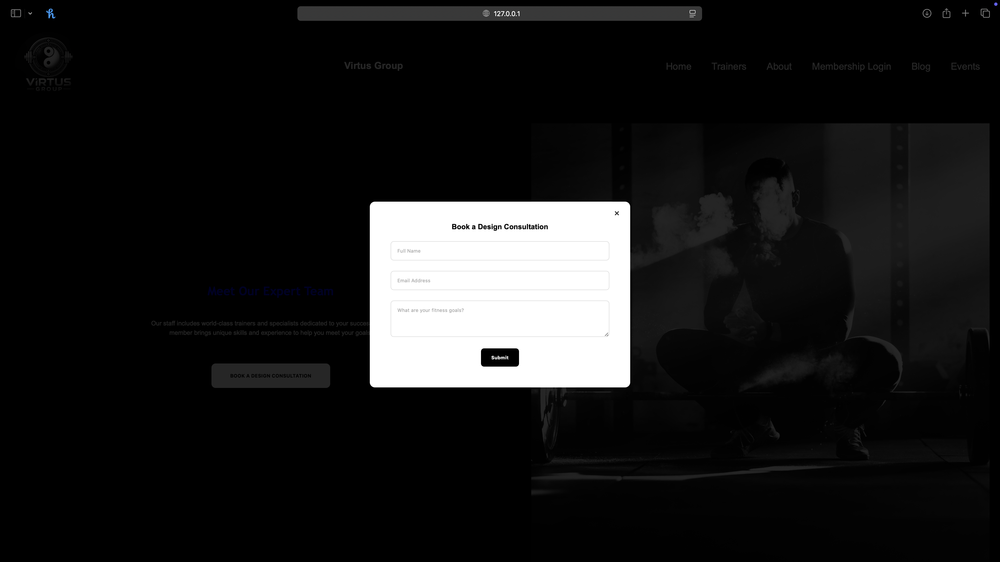

### Mobile View Tests
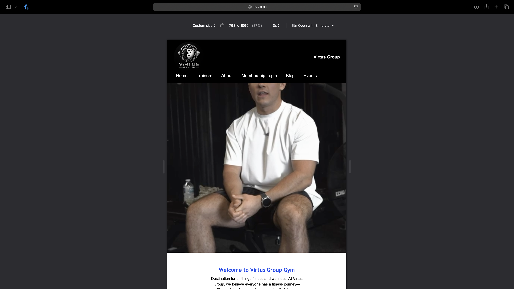  
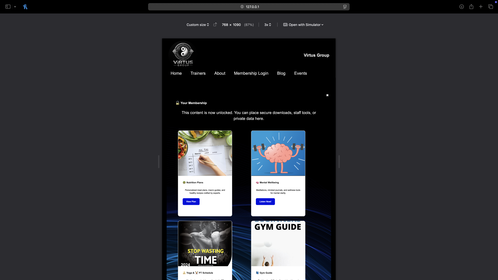  
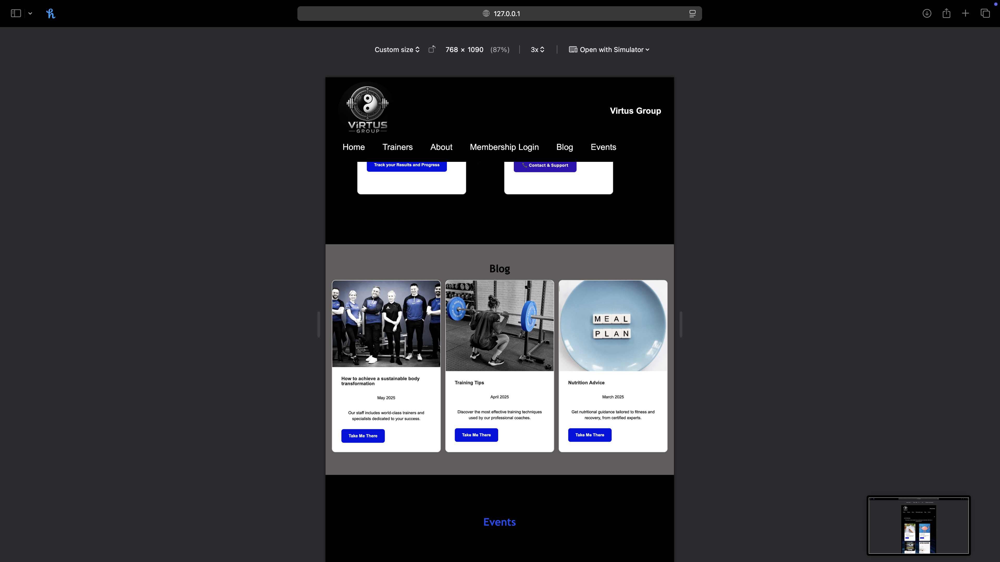  
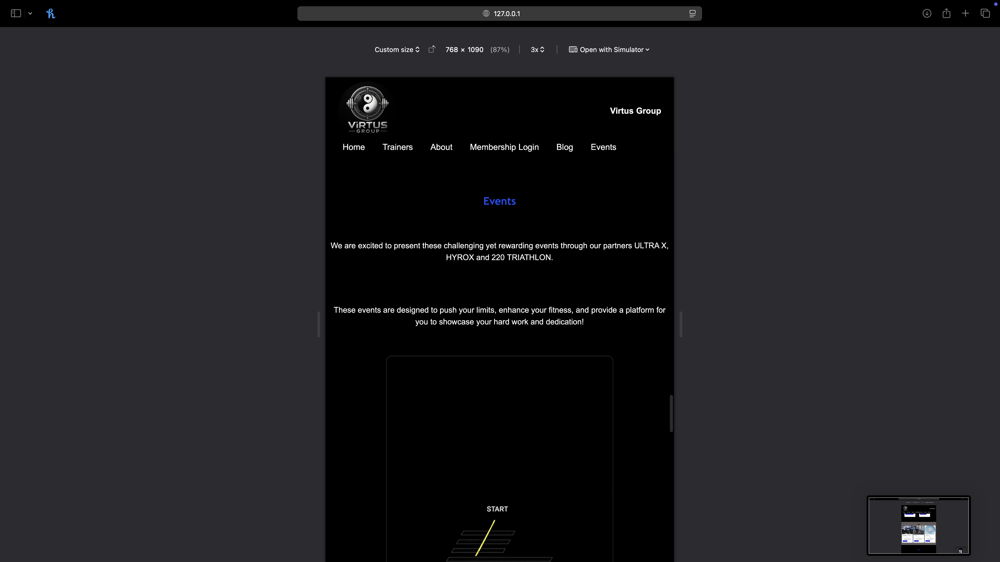  
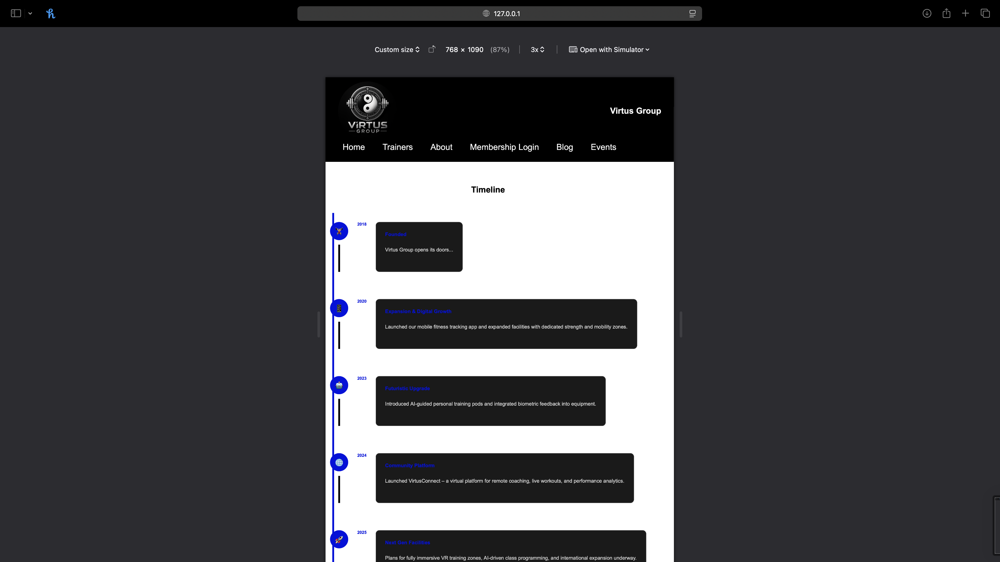

### Desktop View Tests
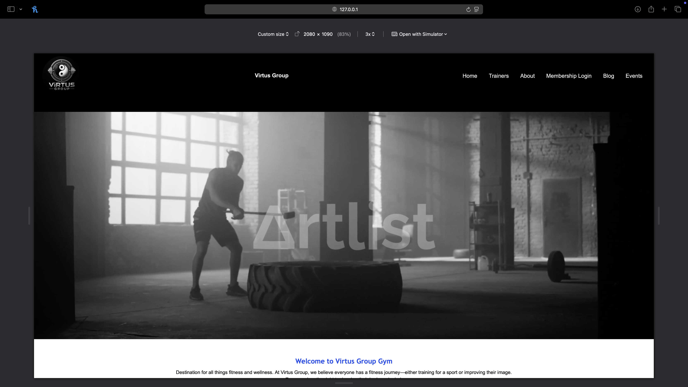  
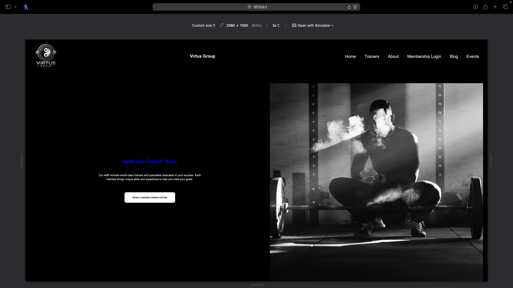  
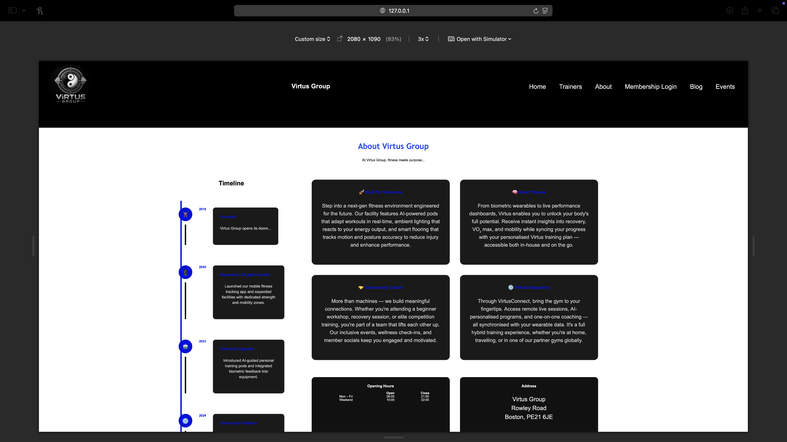  
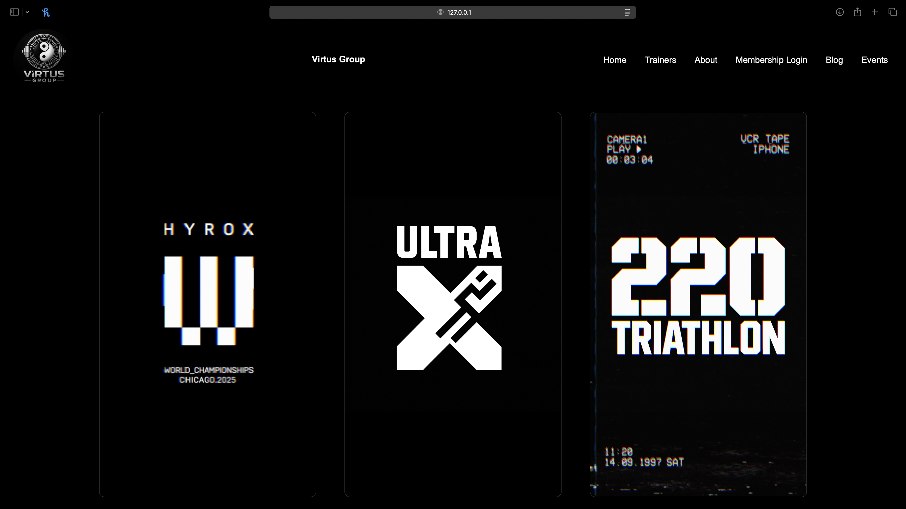

---


## Future Plans

- Integrate real-time booking APIs
- Connect Typeform consultation form for dynamic entry
- Enhance member portal with OAuth-based login
- Add backend CMS for blog & events updates

---

## Contact


**Email**: virtusgroupgyms@gmail.com  
**Project by**: George Baldwin  
**Web Design:** George Baldwin

--- 


Thank you for exploring the **Virtus Group Gym Project**   
Built with passion, purpose, and precision.
# Virtus-group